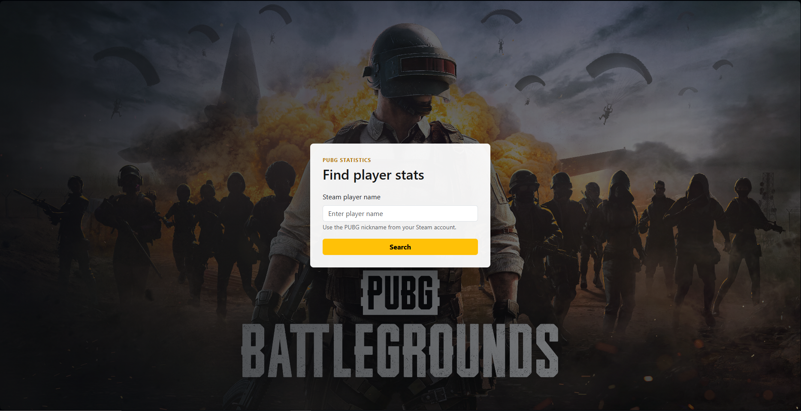
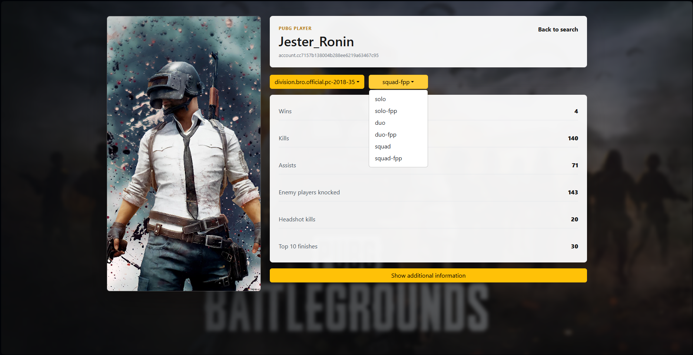

# PUBG Statistics

React app for searching PUBG player statistics by Steam player name. The app loads available seasons from the PUBG API, selects the current season by default, and lets you switch both season and game mode.

## Preview

### Search screen



### Statistics screen



## Features

- Search PUBG player by Steam nickname
- Open player statistics directly from URL
- Current season selected by default
- Scrollable season dropdown
- Game mode dropdown
- Loading and error states for PUBG API responses
- Responsive UI
- API key stored in local environment config

## Stack

- React 18
- TypeScript
- Redux Toolkit
- React Router
- React Bootstrap
- PUBG API

## Setup

Install dependencies:

```bash
npm install
```

Create `.env` from `.env.example` and add your PUBG API key:

```env
REACT_APP_PUBG_API_KEY=your_pubg_api_key_here
```

Start the app:

```bash
npm start
```

## Scripts

Build production bundle:

```bash
npm run build
```

Run tests:

```bash
npm test -- --watchAll=false
```

## Notes

The real `.env` file should not be committed. For a public production app, the safer long-term approach is to move PUBG API calls behind a backend or serverless proxy instead of calling the API directly from the browser.
